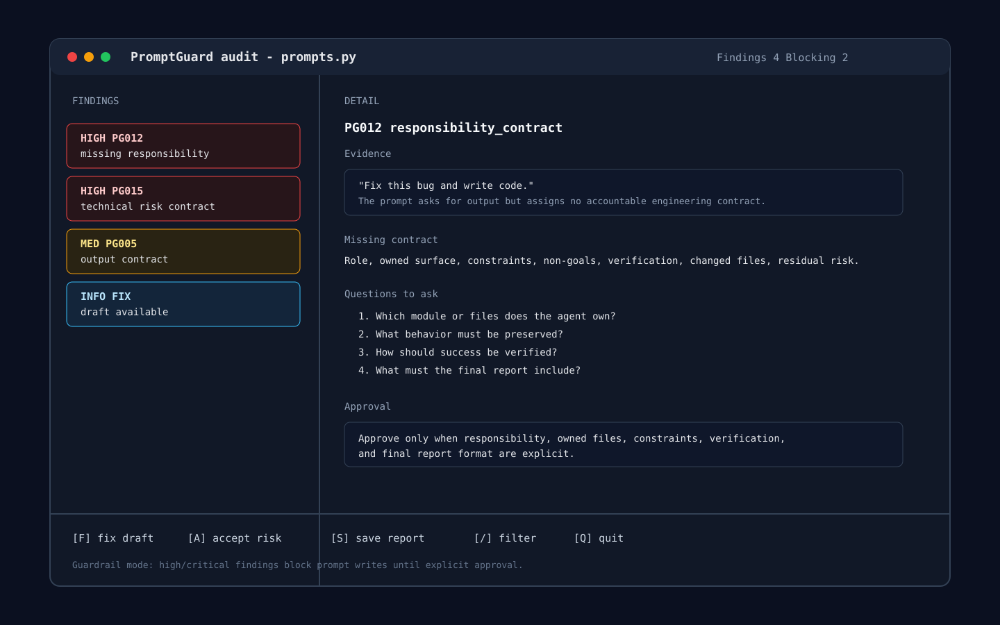

<p align="center">
  
</p>

# PromptGuard

PromptGuard audits prompts as behavioral contracts.

It is for agent workflows where vague prompts cause bad work, especially when an agent is about to edit files, seed system prompts, or ship code:

```text
Fix this bug and write code.
Build this endpoint.
Give me the report.
Add this system prompt.
```

Think of it as a prompt linter for responsibility, safety, and execution contracts.

Most prompt advice says "write better prompts." PromptGuard turns that into an executable check:

- Is the task actually specified?
- Is the agent responsible for a clear surface?
- Are output format, constraints, risks, and verification explicit?
- Are safety boundaries contradicted later in the prompt?
- Should the agent ask for missing data instead of hallucinating a deliverable?



PromptGuard does not only say "bad prompt." It reports:

- what decision is missing
- what question to ask
- what contract is required
- what must be true before approval
- how to rewrite the prompt

## What It Catches

- `PG001` privacy conflicts
- `PG002` unsafe/passive escalation
- `PG003` agent boundary drift
- `PG004` weak tool/function schema
- `PG005` missing output contract
- `PG007` vague deliverable intent
- `PG008` later rule overriding earlier boundary
- `PG009` long context without state retention
- `PG010` false certainty without sources
- `PG011` broad task without acceptance criteria
- `PG012` coding prompt without responsibility
- `PG013` recommendation without decision context
- `PG014` high-stakes advice without safety/source contract
- `PG015` technical change without risk/verification contract

## Quick Start

Run without installing:

```bash
python3 -m promptguard audit prompts.py
printf '%s' 'Fix this bug and write code.' | python3 -m promptguard audit - --format markdown
```

Install as a local CLI:

```bash
python3 -m venv .venv
source .venv/bin/activate
python -m pip install -e .
promptguard audit prompts.py
```

Install as an app with `pipx`:

```bash
pipx install promptguard
promptguard audit prompts.py
```

Install from GitHub before a package release:

```bash
pipx install "git+https://github.com/<owner>/promptguard.git"
```

Save reports:

```bash
promptguard audit prompts.py --format json --save
```

Saved reports go to:

```text
.promptguard/reports.jsonl
```

## Agent-Native Guard

Install adapters:

```bash
./install-agent-adapters.sh codex
./install-agent-adapters.sh claude
./install-agent-adapters.sh opencode
./install-agent-adapters.sh openclaw
```

Restart the agent after install.

Behavior:

- prompt-like edits are audited before writing
- high/critical findings block write until explicit approval
- Codex/OpenCode get global `AGENTS.md` rules
- OpenClaw gets workspace `AGENTS.md` plus a `before_tool_call` plugin that blocks unsafe prompt writes
- Claude gets `CLAUDE.md`, optional hook config, and `/prompt-audit`
- The adapters copy the self-contained `skills/promptguard` bundle into each agent config/workspace directory, so the guard can run without a separate global CLI install.

Adapter status:

| Agent | Install target | Automatic behavior |
| --- | --- | --- |
| Codex | `~/.codex/skills/promptguard` + `~/.codex/AGENTS.md` | Audits prompt-like write requests before editing |
| Claude | `~/.claude/skills/promptguard` + `CLAUDE.md` + optional hook | Hook can inject PromptGuard findings before the turn |
| OpenCode | `~/.config/opencode/skills/promptguard` + `AGENTS.md` | Audits prompt-like write requests before editing |
| OpenClaw | `~/.openclaw/workspace/skills/promptguard` + plugin | Blocks unsafe prompt `write`/`edit` tool calls with `before_tool_call` |

## Installable Skill

The portable skill lives at:

```text
skills/promptguard
```

Install from a skill installer by pointing to that path.

## Examples

Bad:

```text
Prod auth patlıyor galiba, refresh atınca bazı kullanıcılar düşüyor. Bi bakıp hızlıca fixler misin, akşama deploy lazım.
```

Expected findings:

- `PG012 responsibility_contract`
- `PG015 technical_risk_contract`

Better:

```text
Act as the backend engineer responsible for src/auth/session.py and tests/auth. Fix the refresh-token logout bug only. Preserve public API behavior and do not refactor unrelated code. Validate expired token, reused-token, and concurrent-refresh edge cases. Verify with `pytest tests/auth -q`. Return changed files, root cause, verification output, deploy/rollback note, and residual risk.
```

## Development

Run tests:

```bash
python3 -m pytest -q
```

Package smoke test:

```bash
tmpdir=$(mktemp -d /tmp/pg-package.XXXXXX)
python3 -m venv "$tmpdir/venv"
"$tmpdir/venv/bin/python" -m pip install -e .
printf '%s' 'Fix this bug and write code.' | "$tmpdir/venv/bin/promptguard" audit - --format table
```

Eval sets:

```text
eval/cases.jsonl
eval/daily_life_cases.jsonl
eval/technical_cases.jsonl
eval/real_world_usage_cases.jsonl
```

More usage examples are in [USAGE.md](USAGE.md).

Real-world prompt examples are in [EXAMPLES.md](EXAMPLES.md).

TUI design notes are in [docs/TUI.md](docs/TUI.md).
